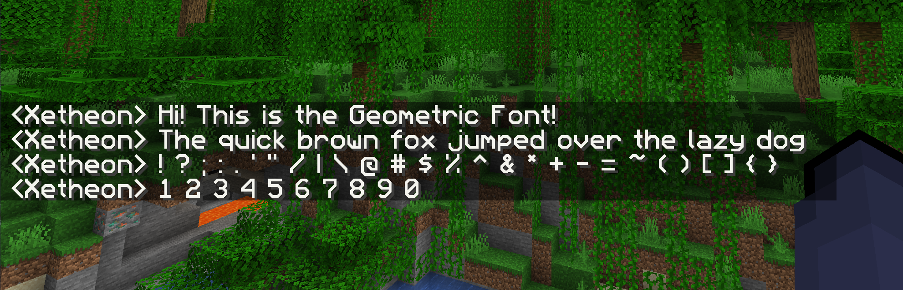

> A sharp, clean remake of the default mojangles font in full HD

## Install

Note: This resourcepack is GUI-scale dependent. Make sure to download the one for the size you play with the most for the best experience!

#### Find your resourcepacks folder

To install this pack you need to first find your resourcepack folder. The quickest and easiest way to do this is from in-game.

1. Open up your desired version of Minecraft.
2. Go into "Options" and then "Resource Packs"
3. Click "Open Pack Folder"

#### Download the pack

You can find the pack on all these platforms:

|  |  |  |
| --- | --- | --- |
| [Modrinth](https://modrinth.com/resourcepack/geometric-font) | [Curseforge](https://www.curseforge.com/minecraft/texture-packs/geometric-font) | [Github](https://github.com/xetheon/mc-geometric-font/releases) |

After downloading the version and GUI size of your choice, simply put the .zip in your resourcepacks folder and enable in-game!

##### If you have any troubles installing, check out the Minecraft Wiki page on [how to install resourcepacks](https://minecraft.fandom.com/wiki/Tutorials/Loading_a_resource_pack).

## Resources

- Want to use this font in your own works? See the [license](https://github.com/Xetheon/mc-geometric-font/blob/main/LICENSE.md)
- Curious about updates on things I work on or just want to hang out? Join my [Discord!](https://discord.gg/3gtNAQgv2G)
- Interested in other packs I've made? Check out [this list!](https://gist.github.com/Xetheon/c3d677e0762658f8d79cf05e2c6e65ff)
