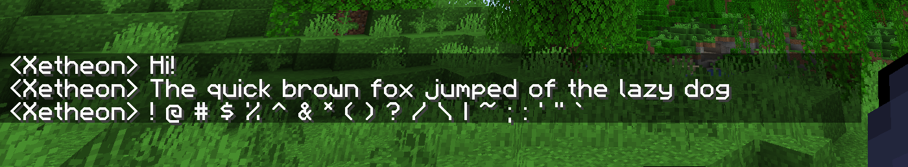

> A sharp, clean remake of the default mojangles font in full HD

## Install

#### Find your resourcepacks folder

The quickest and easiest way to do this is from in-game.

1. Open up your desired version of Minecraft.
2. Go into "Options" and then "Resource Packs"
3. Click "Open Pack Folder"

#### Download the pack

The easiest way to do this is to clone the repo, if you have Git installed. Open a terminal or commandline in your resourcepacks folder and clone:

    git clone https://github.com/Xetheon/mc-geometric-font "Geometric Font"

This will also keep the pack up do date automatically. Alternatively, you can download the pack manually by going to any of its release pages.

- [Github Releases](https://github.com/Xetheon/mc-geometric-font/releases)
- [Modrinth](https://modrinth.com/resourcepack/geometric-font)
- [CurseForge](https://www.curseforge.com/minecraft/texture-packs/geometric-font)

##### If you have any troubles installing, check out the Minecraft Wiki page on [how to install resourcepacks](https://minecraft.fandom.com/wiki/Tutorials/Loading_a_resource_pack).

## Resources

- Want to use this font in your own works? See the [license](https://github.com/Xetheon/mc-geometric-font/blob/main/LICENSE.md)
- Curious about updates on things I work on or just want to hang out? Join my [Discord!](https://discord.gg/3gtNAQgv2G)
- Interested in other packs I've made? Check out [this list!](https://gist.github.com/Xetheon/c3d677e0762658f8d79cf05e2c6e65ff)
