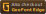

    

## Install

#### Find your resourcepacks folder

To install this pack you need to first find your resourcepack folder. The quickest and easiest way to do this is from in-game.

1. Open up your desired version of Minecraft.
2. Go into "Options" and then "Resource Packs"
3. Click "Open Pack Folder"

#### Download the pack

If you're familiar with Git, you can easily set up the pack and have it updated automatically that way. Open a terminal or commandline in your resourcepacks folder and clone the repo.

    git clone https://github.com/zentheon/mc-geometric-font "GeoFont"

Or, for Edge:

    git clone https://github.com/zentheon/mc-geometric-font -b edge "GeoFont Edge"

Alternatively, you can also download the pack by going to any of its release pages:

|  |  |  |
| --- | --- | --- |
| [Modrinth](https://modrinth.com/resourcepack/geometric-font-2) | [Github](https://github.com/xetheon/mc-geometric-font/releases) |

##### If you have any troubles installing, check out the Minecraft Wiki page on [how to install resourcepacks](https://minecraft.wiki/w/Tutorial:Loading_a_resource_pack).

## Resources

- Want to use this font in your own works? See the [license](https://github.com/zentheon/mc-geometric-font/blob/main/LICENSE.md)
- Curious about updates on things I work on or just want to hang out? Join my [Discord!](https://discord.gg/3gtNAQgv2G)
- Interested in other packs I've made? Check out [this list!](https://gist.github.com/zentheon/c3d677e0762658f8d79cf05e2c6e65ff)
- The GeoFont typeface can be found in its own repo [here!](https://github.com/zentheon/GeoFont)
